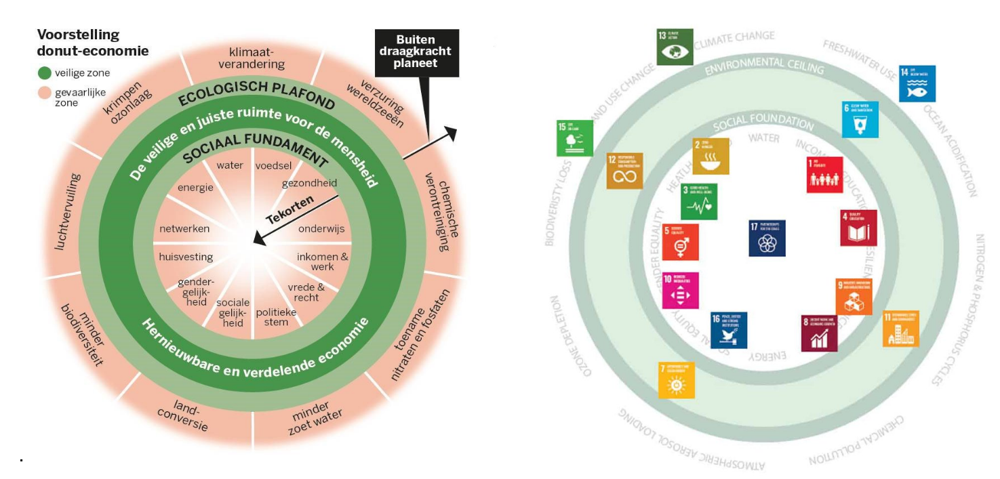

# 8. Systeemanalyse 2: Causaal diagram
## 8.1 causale lussen
In de vorige les hebben we op basis van een set variabelen een relatiecirkel gemaakt. Tussen variabelen hebben we directe causale verbanden weergegeven met pijlen. Aan deze pijlen hebben we een **s(ame)** of **o(pposite)**-label toegekend.

In deze les zetten we de volgende stap naar een uitgebreider systeem: een **causaal diagram**. In een causaal diagram blijven de variabelen en relaties uit de relatiecirkel behouden, maar daarnaast worden ook **causale lussen** zichtbaar. Dit zijn grotere circulaire verbanden tussen variabelen met een versterkend of een dempend effect, respectievelijk **R(eïnforcing)** en **B(alancing) lussen**.

## Voorbeeld uit de les
```
{figure} Plaatjes/systeemdiagram_plastic_soep2.png
:width: 500px
:align: center
:name: syteem_soep
``` 
*Figuur 1. Visualisatie van feedbacklussen in plasticproductie*

In het systeem van plasticproductie en -vervuiling werken balancerende en versterkende feedbacklussen tegelijkertijd:
**Dempende lus (B-loop):** regelgeving en consumentengedrag kunnen de productie van plastic afremmen.
**Versterkende lus (R-loop):** lagere productiekosten en een toenemende vraag stimuleren juist de plasticproductie.

De uiteindelijke uitkomst hangt af van welke krachten domineren. Als regelgeving en bewustwording sterk genoeg zijn, kan de negatieve impact van plasticvervuiling worden beperkt. Maar als de economische krachten van vraag en aanbod overheersen, zal de plasticproductie blijven toenemen en het ecologische probleem verergeren.
De gecombineerde feedbacklussen laten zien hoe balancerende en versterkende krachten invloed hebben op het probleem van **plasticsoep**. Dit raakt meerdere **Werelddoelen (SDG’s)**:
- **SDG 14 (Leven in het Water)** en **SDG 15 (Leven op het Land):** impact van plasticvervuiling op ecosystemen.
- **SDG 3 (Gezondheid en welzijn)** en **SDG 6 (Schoon drinkwater):** gevolgen voor menselijke gezondheid en waterkwaliteit.
- **SDG 12 (Verantwoorde Consumptie en Productie)** en **SDG 13 (Klimaatactie):** het belang van beleid en gedragsverandering om de milieu-impact te beperken.

Dit illustreert hoe systeemdenken helpt om complexe problemen te begrijpen en hoe beleid en bewustwording nodig zijn om economische groeidynamiek in balans te brengen met sociale en ecologische grenzen (zoals geformuleerd in de **Doughnut van Raworth**).


. 
## 8.2 Leerlingopdrachten

### Oriëntatie met chatbot

Gebruik de chatbot om een eerste verkenning van het systeem te maken. Voorbeeldprompts:
- **Geef een lijst van variabelen** (zaken die kunnen toe- of afnemen) in de complexe context van … (gebruik verschillende perspectieven, bijvoorbeeld de **3 P’s**: People, Planet, Prosperity). (Specificeer als het antwoord te ruim is.)
- **Schets met deze variabelen een causaal diagram** met **O(pposite)-** en **S(ame)-pijlen**. Zoek naar causale lussen en beschrijf een betekenisvol verhaal.
- **Licht enkele belangrijke R(eïnforcing)- en B(alancing)-lussen eruit** waarin je centrale variabele een plek heeft en vertel het bijbehorende verhaal.
- **Aan welke SDG’s raken deze verhalen?**
- **Hoe verhoudt dit complexe systeem zich tot de Doughnut van Raworth?**
- **Zoek en benoem leverage points (hefboompunten).** Dit zijn variabelen in je systeem waarmee je het systeem heel sterk zou kunnen beïnvloeden.
- ⚠️ **Let op:** Wees kritisch op de gegenereerde antwoorden. Vraag door en controleer de logica.
### Uitwerking causaal diagram

Na de oriëntatie ga je zelf aan de slag met het maken van een causaal diagram:
Gebruik  om je causale diagram te maken: [insightmaker](https://insightmaker.com/)
- **Voer alleen variabelen en verbanden in die je zelf begrijpt.** Het helpt om hier een verhaal bij te maken.
- **Geef in je causale diagram ook R- en B-loops weer** en analyseer hoe deze feedbacklussen het systeem beïnvloeden.
Door deze oefening krijg je inzicht in eigenschappen van complexe systemen en hoe verschillende krachten samenwerken of tegenwerken binnen een complex vraagstuk.
